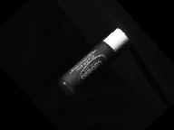
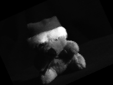
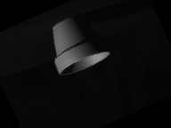

# Context Base Image Retrieval (Google Lens)
*An Image Processing Project by Ryan Li Jian Tang*

## Project Synopsis

This is an Image Processing project done in **MatLab**, to create from Scratch a product similar to Google Lens, in the way that based on a given Input (Context), the Model will be able to find a similar Object as an output. This involved heavily understanding the processing standards done towards images and how to code the models from Scratch.

**Models And Concepts Used:**
- Bag Of Features
- SURF
- SIFT
- CNN

## General Process Done:
1. Data Preparation (Image Processing)
2. Creation Of Models
3. Training & Tuning of Models
4. Testing Models
5. Creating IO System

As this was an Academia project, it was all done in MatLab, which is mostly used an Image Processing System. This can be easily replicated in Python. As the project was a proof-of-concept, the model was trained on a series of 500 Objects with 30 variants of each as shown in the images under "processed".

Creations of Multiple Models were created and tested to see the accuracy of each model. In this case the a Fusion Model was created in the end.

## Samples of Images:
### Examples of Training Images:
To Train Invariance, Images were randomly flipped and inverted to test for invariance

# Example of Query Images
Input:

Output:

