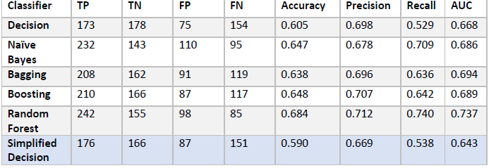
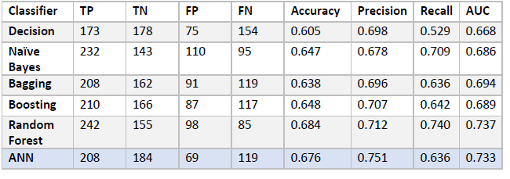
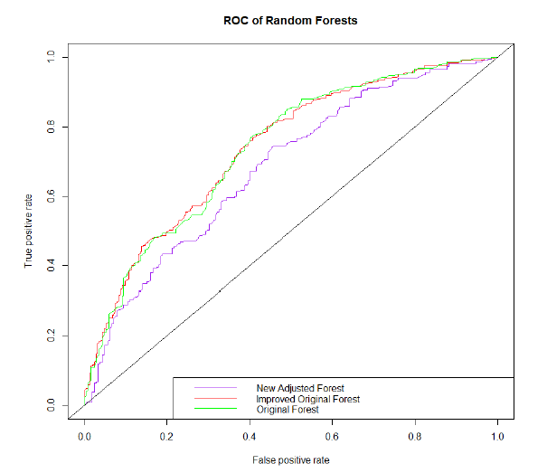

# Will it be Warmer Tomorrow?
#### *A Machine Learning Project by Ryan Li Jian Tang*

## Table of Contents:
- [Will it be Warmer Tomorrow?](#will-it-be-warmer-tomorrow)
      - [*A Machine Learning Project by Ryan Li Jian Tang*](#a-machine-learning-project-by-ryan-li-jian-tang)
  - [Table of Contents:](#table-of-contents)
  - [Project Synopsis](#project-synopsis)
  - [Programming Language Used](#programming-language-used)
  - [General Process Done:](#general-process-done)
  - [Results of Model](#results-of-model)

[Proper Report](https://github.com/RyTang/Monash-Projects/blob/main/Data%20Analysis/Machine%20Learning/Data%20Report.pdf)

[R Code]()

## Project Synopsis

This is a project done in **R**, based on weather data from Australia. The objective is to find ways to correctly predict if the next day will be warmer depending on current factors, but not limited to, like date, wind direction, temperature, clouds, pressure. 

**Models Used:**
- Decision Trees
- Naive Bayes
- Bagging
- Boosting
- Random Forest
- Artificial Neural Network
  
A 2000 days sample of the goliath dataset was used instead to ease the training time in building models. [*Sample Data Link*](https://raw.githubusercontent.com/RyTang/Monash-Projects/main/Data%20Analysis/Machine%20Learning/WarmerTomorrow2022.csv)

## Programming Language Used
**Tools: R, RStudio**

For this project, R was used extensively from the start to the end. This includes the data preparation, analysis, modelling and tuning of the models.

## General Process Done:
1. Data Preparation
2. Data Analysis
3. Creation on Model
4. Compare Results of Models
5. Omitting Variables
6. Tune hyper-parameters on Models

To create a non-biased model, it is important to ensure that the data is processed and cleansed.  Meaning anomalous data should be highlighted and fixed. Data will then be analysed in attempts of omitting variables that do not reduce the entropy of the dataset: i.e through efforts of correlation matrix. Thereby, the models can then be trained upon the cleaned dataset. Wherefore, analysis on the results will show which model is best suited for the model.

An in-depth exploration of the process can be found in the report [here](https://github.com/RyTang/Monash-Projects/blob/main/Data%20Analysis/Machine%20Learning/Data%20Report.pdf)

## Results of Model

Model Comparisons to a Decision tree with omitted variables

Model Comparisons to Artifical Neural Network Model

ROC Curve Comparison of Improved Random Forest vs Original
